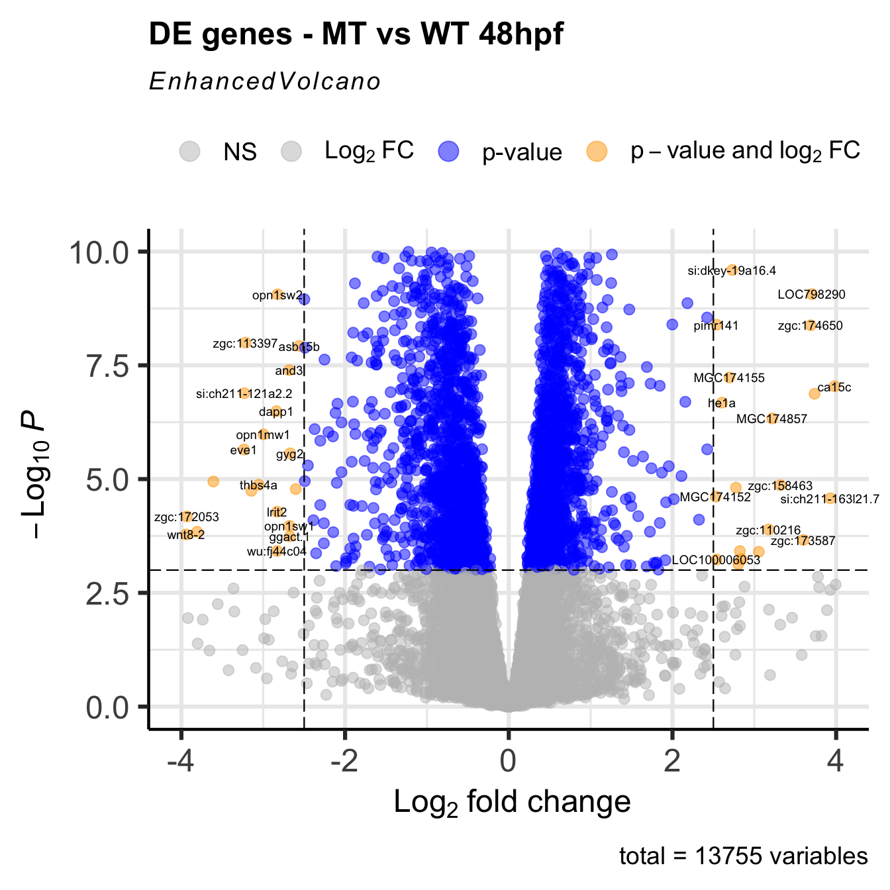

# ZebraQ

## Introduction to R and bulk-RNAseq data analysis using DESeq2

This is a introductory course intended for beginners in R and RNAseq data analysis. For more advanced users we recommend the DESeq2 tutorial: <https://bioconductor.org/packages/devel/bioc/vignettes/DESeq2/inst/doc/DESeq2.html>.

## Course structure

The course is divided in two parts:

1.  Basic introduction to R environment

-   S1: data structures and basic operations.
-   S2: data import and export.
-   S3: summary statistics and data visualization.

2.  RNAseq data analysis

-   S4: RNA-seq data analysis with DESeq2.
-   S5: Exploring and visualizing RNA-seq data.

`/lessons` folder contains the Rmarkdown files and rendered html for each lesson.

## Installation

All required R-packages can be installed following `setup\Installation_and_setup.Rmd`.

## Materials

Link to supporting slides: `/slides/Practical_Section_II.pdf`

## Dataset

*Disclaimer: The data used in this course is intended to be used for educational purposes only.*

`/data` folder contains the following files:

-   Genes associated with CHD with functional annotations: `data/chd_genes.annotations.tsv`

-   Gene counts from RNA-seq data of wild type and mutant zebrafish (*Danio Rerio*) hearts: `data/salmon.merged.gene_counts.tsv`

## References

1.  [R for Data Science](https://r4ds.had.co.nz/)
2.  [DESeq2](https://bioconductor.org/packages/release/bioc/html/DESeq2.html)

## Have fun!

