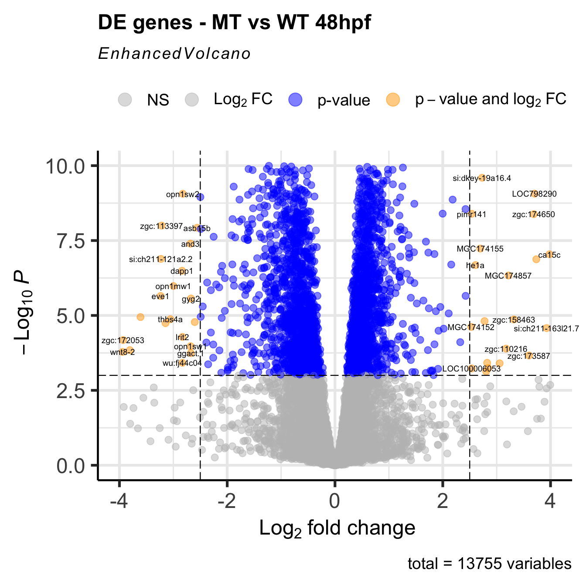

# ZebraQ

## Introduction to R / Python and bulk RNA-seq data analysis with DESeq2

An introductory course for beginners in programming and RNA-seq data analysis,
built for biotechnology students with little or no bioinformatics background.

The course is available in **two parallel tracks: R and Python**. They cover the
same material, use the same datasets, and reach the same biological conclusions.
Which one is taught depends on the cohort; pick whichever suits you.

For more advanced users we recommend the
[DESeq2 vignette](https://bioconductor.org/packages/devel/bioc/vignettes/DESeq2/inst/doc/DESeq2.html).

---

## Course structure

### Part 1 — programming and data handling

| | Topic |
| --- | --- |
| S1 | Data structures and basic operations |
| S2 | Importing and exporting data |
| S3 | Summary statistics and data visualisation |

### Part 2 — RNA-seq analysis

| | Topic |
| --- | --- |
| S4 | Differential expression analysis |
| S5 | Exploring and visualising RNA-seq results |
| S6 | Bonus: hands-on with a public dataset (GSE106118) |

---

## 🐍 Python track

Runs in **Google Colab with nothing to install** - click a badge and start.

| Lesson | Notebook | Open |
| --- | --- | --- |
| S1 | [Python data structures](lessons-py/S1_Python_Data_Structures.ipynb) |  |
| S2 | [Importing and exporting data](lessons-py/S2_Import_Export_Data.ipynb) |  |
| S3 | [Exploratory data analysis](lessons-py/S3_Exploratory_Data_Analysis.ipynb) |  |
| S4 | [Differential expression with PyDESeq2](lessons-py/S4_PyDESeq2_Analysis.ipynb) |  |
| S5 | [Visualising RNA-seq results](lessons-py/S5_PyDESeq2_Visualization.ipynb) |  |
| S6 | [Bonus — GSE106118](lessons-py/S6_Bonus_GSE106118.ipynb) |  |

Every notebook is **self-contained**: it fetches its own data and does not require
you to have run any earlier lesson.

Setup instructions for running locally: [`setup/python/README.md`](setup/python/README.md).

---

## 📊 R track

R markdown sources and rendered HTML are in [`lessons-r/`](lessons-r/).

| Lesson | Source | Rendered |
| --- | --- | --- |
| S1 | [S1_R_Data_Structures.Rmd](lessons-r/S1/S1_R_Data_Structures.Rmd) | [html](lessons-r/S1/S1_R_Data_Structures.html) |
| S2 | [S2_Import_Export_Data_in_R.Rmd](lessons-r/S2/S2_Import_Export_Data_in_R.Rmd) | [html](lessons-r/S2/S2_Import_Export_Data_in_R.html) |
| S3 | [S3_Exploratory_Data_Analysis.Rmd](lessons-r/S3/S3_Exploratory_Data_Analysis.Rmd) | [html](lessons-r/S3/S3_Exploratory_Data_Analysis.html) |
| S4 | [S4_DESeq_analysis.Rmd](lessons-r/S4/S4_DESeq_analysis.Rmd) | [html](lessons-r/S4/S4_DESeq_analysis.html) |
| S5 | [S5_DESeq_visualization.Rmd](lessons-r/S5/S5_DESeq_visualization.Rmd) | [html](lessons-r/S5/S5_DESeq_visualization.html) |
| S6 | [S6_Bonus.Rmd](lessons-r/S6/S6_Bonus.Rmd) | [html](lessons-r/S6/S6_Bonus.html) |

Required R packages: [`setup/Installation_and_setup.Rmd`](setup/Installation_and_setup.Rmd).

---

## Do the two tracks give the same answer?

Close enough to teach either, and the difference is worth understanding.

DESeq2 (R) and PyDESeq2 (Python) are independent implementations of the same
method, so they are not bit-identical. Running both on this course's zebrafish
dataset (13,755 genes after filtering):

| Comparison | Result |
| --- | --- |
| Genes tested | 13,755 in both |
| log2 fold change, Spearman correlation | 1.000000 |
| Agreement on the significant set | Jaccard 0.996 |

S4 of the Python track reproduces this comparison live, so students can see it
rather than take it on trust.

---

## Dataset

*Disclaimer: the data used in this course is for educational purposes only.*

[`data/`](data/) is shared by both tracks:

| File | Contents |
| --- | --- |
| `chd_genes.annotations.tsv` | 276 genes associated with congenital heart disease, with gnomAD constraint metrics (also provided as `.csv` and `.xlsx`) |
| `salmon.merged.gene_counts.filtered.tsv` | Gene counts from RNA-seq of wild-type and mutant zebrafish (*Danio rerio*) hearts at 48 hpf. **Dataset is incomplete and results are therefore uninterpretable** |
| `samplesheet.tsv` | Sample metadata for the zebrafish experiment (3 WT, 3 MT) |
| `GSE106118_HE10W.tsv.gz` | Public human fetal heart expression data used in the S6 bonus lesson |

---

## Materials

Supporting slides: [`slides/Practical_Section_II.pdf`](slides/Practical_Section_II.pdf)

---

## References

1. [R for Data Science](https://r4ds.had.co.nz/)
2. [Python Data Science Handbook](https://jakevdp.github.io/PythonDataScienceHandbook/)
3. [DESeq2](https://bioconductor.org/packages/release/bioc/html/DESeq2.html)
4. [PyDESeq2](https://pydeseq2.readthedocs.io/)

---

## Maintainer

Enrique Audain (enrique.audain@uni-oldenburg.de)

## Have fun!

